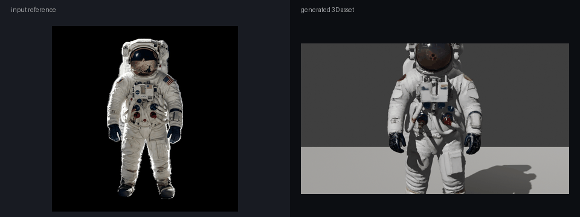

# TRELLIS.2 MPS for Apple Silicon

This repository is an Apple Silicon/MPS compatibility package for Microsoft
TRELLIS.2 image-to-3D generation. It keeps the original TRELLIS.2 source in
`TRELLIS.2/`, adds Mac-focused runtime patches and backends, and documents the
exact local validation used to run image-to-3D generation on this Mac.

The original Microsoft project remains the authority for TRELLIS.2 model
architecture, training details, and upstream research context:

- Original repo: https://github.com/microsoft/TRELLIS.2
- Upstream README preserved here: [UPSTREAM_README.md](UPSTREAM_README.md)
- Detailed Mac port notes: [MPS_PORT_NOTES.md](MPS_PORT_NOTES.md)

This repo is source-only. It does not include model weights, Hugging Face
caches, `.env` files, virtual environments, generated GLB/OBJ outputs, or local
secrets.

## Current Status

Validated on Apple Silicon with PyTorch MPS and Metal texture baking:

- TRELLIS.2 image-to-3D generation works locally on MPS for the validated smoke
  path.
- Dense attention and sparse attention run through PyTorch SDPA.
- Sparse convolution runs through a pure PyTorch fallback.
- Mesh extraction and GLB postprocessing run without NVIDIA CUDA.
- The validated image-to-3D path produced a textured GLB that passed Blender
  asset validation.

Validated smoke output:

- Input: `assets/shoe_input.png`
- Pipeline: `512`
- Seed: `42`
- Texture size: `512`
- Output GLB from the original workspace: 7.6 MB
- Blender validation: 1 mesh, 1 material, 153,708 vertices, 197,529 triangles,
  no findings

Manifest: [manifests/trellis_mac_probe.json](manifests/trellis_mac_probe.json)

## Astronaut Example

This visual shows a normalized astronaut input image on the left and a rotating
review of the generated 3D asset on the right.

<p align="center">
  
</p>

Additional astronaut review files:

- Input reference: [assets/astronaut/astronaut_input_front.png](assets/astronaut/astronaut_input_front.png)
- Generated asset contact sheet: [assets/astronaut/astronaut_generated_contact_sheet.png](assets/astronaut/astronaut_generated_contact_sheet.png)

The astronaut asset was generated from a single front reference and visually
reviewed as a generated asset. It is useful as a smoke-test example for the Mac
pipeline, not as a claim that single-image generation fully reconstructs a
production astronaut suit from all sides.

## What Changed for Mac/MPS

- Attention defaults use PyTorch SDPA instead of CUDA-only attention packages.
- Sparse convolution uses a pure PyTorch gather/scatter backend.
- Mesh extraction uses a Python fallback instead of CUDA hash-map kernels.
- The generated mesh can be simplified before texture baking to avoid
  Metal-side instability on very large decoder meshes.
- Texture baking prefers the available Metal path and can fall back to a
  Python/xatlas/KDTree baker.
- Hard CUDA device assumptions in the vendored TRELLIS.2 source were patched to
  use the active local device where possible.
- `generate.py` selects the Mac-safe backends before importing TRELLIS.2.
- `generate.py` can load a Hugging Face token from a local `.env` without
  printing secret values.

## Requirements

- Apple Silicon Mac.
- Python 3.11+ recommended.
- `uv` recommended.
- PyTorch with MPS support.
- Xcode command line tools.
- Xcode Metal toolchain for the accelerated texture baking path:

```bash
xcodebuild -downloadComponent MetalToolchain
```

- Hugging Face access to:
  - `microsoft/TRELLIS.2-4B`
  - `facebook/dinov3-vitl16-pretrain-lvd1689m`
  - `briaai/RMBG-2.0`

First-time use downloads large model weights through Hugging Face. Those weights
are governed by their upstream model licenses and are not redistributed here.

## Setup

```bash
git clone git@github.com:t7r0n/trellis2-mps.git
cd trellis2-mps

bash setup.sh
source .venv/bin/activate
```

Authenticate with Hugging Face:

```bash
hf auth login
```

Or create a local `.env` file:

```bash
HF_TOKEN=hf_xxx
```

To skip the Metal build and use the Python texture-baking fallback:

```bash
SKIP_METAL=1 bash setup.sh
```

## Run the Smoke Test

```bash
python generate.py assets/shoe_input.png \
  --output outputs/shoe_probe \
  --pipeline-type 512 \
  --texture-size 512 \
  --seed 42
```

Expected outputs:

```text
outputs/shoe_probe.glb
outputs/shoe_probe.obj
```

The first run can take a long time because TRELLIS.2, DINOv3, and RMBG weights
may need to download and load.

## Normal Usage

```bash
python generate.py path/to/image.png \
  --output outputs/my_model \
  --pipeline-type 512 \
  --texture-size 1024 \
  --seed 123
```

Options:

| Option | Default | Description |
|---|---:|---|
| `--seed` | `42` | Random seed for generation |
| `--output` | `output_3d` | Output filename without extension |
| `--pipeline-type` | `512` | Pipeline resolution: `512`, `1024`, or `1024_cascade` |
| `--texture-size` | `1024` | PBR texture resolution: `512`, `1024`, or `2048` |
| `--no-texture` | off | Skip texture baking and export geometry only |

## Known Limits

- This is an inference-focused Mac compatibility package, not a full CUDA
  rewrite of every upstream kernel.
- Very high-resolution modes can exceed 24 GB unified memory.
- The pure PyTorch sparse convolution fallback is slower than CUDA kernels.
- Some tiny mesh holes may remain because CUDA-only hole-filling paths are not
  fully reproduced.
- Meshes may be pre-simplified before texture baking to avoid Metal-side
  instability on very dense decoder output.
- Training is not supported in this Mac package.
- DINOv3 and RMBG are separate model dependencies with separate license terms.

## Licenses and Attribution

This package keeps upstream licensing and attributions:

- [LICENSE](LICENSE)
- [TRELLIS.2/LICENSE](TRELLIS.2/LICENSE)
- [UPSTREAM_README.md](UPSTREAM_README.md)

Model checkpoints and gated dependencies are governed by their upstream model
licenses and are not redistributed here.
